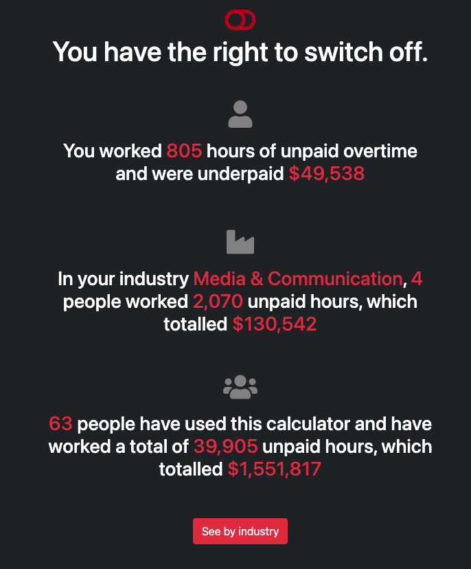
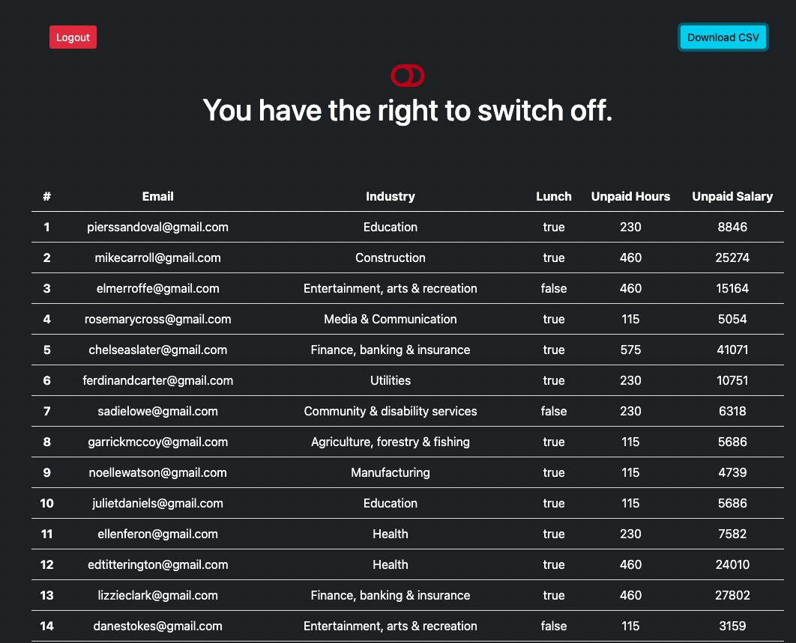

# unpaid-overtime-calc

# Description
---
This project will allow the user to enter the amount of hours worked in a day, which will then calculate the total unpaid hours across the course of a year. 

This tool would mainly be used as a survery tool to register trends across different departments of employment, to give you an understanding of just how much extra time you work. 

 
 # Table of Contents
 
 * [Installation](#installation)
 * [Usage](#usage)
 * [Contributing](#contributing)
 * [Tests](#tests)
 * [License](#license)
 * [Questions](#questions)

# Installation 
---
If you wish to install the repo locally, please follow the instructions below.  Otherwise you can veiw the calculator on the following link [here](https://the-right-to-switch-off.herokuapp.com/).

Step 1 - Clone the github repo

Step 2 - Enter your details in the EXAMPLE .env file and save as .env

Step 3 - Right click the server.js file and `Open in intergrated Terminal`, and run `npm i` to install dependancies

Step 4 - Enter `mysql -u <username> -p` in terminal (this will open sql shell)

Step 5 - Enter your password

Step 6 - Enter `source db/schema.sql`, once this has run enter `quit` to exit the shell

Step 7 - Enter `npm run seed` to seed the test data into the database

Step 8 - Enter `npm start` to open the server connection

Step 9 - Open your browser and enter `localhost:3001` to see the website in action.  

# Usage
---
Entry user will represent the survey participant, who will enter details regarding hours worked, employment department, email, id, and whether they took a lunch break. Once the calculate button is clicked, it will display the total overtime hours worked for the year, in addition to a comparison to others within the same department as reference point. This information is then stored within our database to further enhance the quality by increasing sample size. 

Admin user has access to a login page with admin rights. 
 
Demo Video: 

The following images show the web application's appearance and functionality: 

Entry Page where users can enter their details to calculate their unpaid overtime for a year

Results Page showing the results for the user, as well as for all users to date, and also for others in the same industry.

Admin Results page showing what data an admin can view, and also the ability to download a csv file

# Contributing
---
Created by Cat Ormerod, Michelle Watts, Josep Gaspar, & Jason Bolton - see below for contact details. 

# License
---
Licensed under MIT.
For more information, visit this link.
https://opensource.org/licenses/MIT
  
# Questions
---
Please visit our GitHub at [Unpaid Overtime](https://https://github.com/CatOrmerod/unpaid-overtime-calc)
or reach out to one of the team members

| Name | Email | Github |
|---|---|---|
| Jason Bolton  | [Email Jason](mailto:jasonbolton89@gmail.com) | [Jason Bolton Repo](https://github.com/Jbolton89) |
| Jose Gaspar  | [Email Jose](mailto:josephgaspar725@gmail.com) | [Jose Gaspar Repo](https://github.com/Jose109-001) |
| Cat Ormerod | [Email Cat](mailto:catormerod@gmail.com) | [Cat Ormerod Repo](https://github.com/CatOrmerod) |
| Michelle Watts  | [Email Michelle](mailto:watts.e.michelle@gmail.com) | [Michelle Watts Repo](https://github.com/michellewatts20000) |
